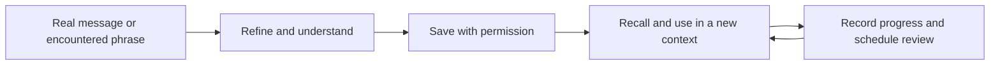

# Verve

**A personal English coach built around one goal: expressing myself precisely without depending on AI.**

I wanted more than polished sentences. I wanted to understand why an expression works, keep my own voice, and be able to use it naturally the next time. Verve turns everyday communication into material for deliberate practice.

## What I built

Verve is a Codex coaching plugin with a Python tool for a local learning library. Its coaching instructions connect immediate help with reusable practice:

- **Polish:** refine real messages while preserving meaning and personality.
- **Decode:** explain tone, humor, cultural context, and subtext.
- **Capture:** save useful words, phrases, sentences, and speaking chunks.
- **Review:** retrieve due items and record active-recall results.
- **Practise:** use role-play, reformulation, and short speaking exercises.

## The learning loop

## What makes it personal

The coaching instructions prioritize my meaning and voice over generic polished English. The library supports a local profile, usage context, examples, and review history, so practice can build on what I have actually encountered.

For example, a rewrite can become a useful speaking chunk; that chunk can later become an active-recall prompt. This is an illustrative workflow, not a published record of my private conversations.

## Implementation

- A plugin manifest and English-coaching skill.
- Reference guides for expression, persona, practice, memory, humor, and subtext.
- A Python command-line library for saving, searching, reviewing, and tracking learning items.
- Local JSON storage, with a configurable data directory.

## Current status

The current version is a coaching plugin with local learning tools. It is not yet a standalone web app and does not fine-tune model weights. Personalization comes from coaching instructions and stored context.

This public showcase excludes personal profiles, learning records, and conversations. The long-term goal is better independent expression—not just better AI rewrites.
