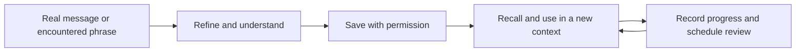

# Verve

**A personal English coach built around one goal: expressing myself precisely without depending on AI.**

I wanted more than polished sentences. I wanted to understand why an expression works, keep my own voice, and be able to use it naturally the next time. Verve turns everyday communication into material for deliberate practice.

## What I built

Verve is a Codex coaching plugin with a Python tool for a local learning library. Its coaching instructions connect immediate help with reusable practice:

- **Polish:** refine real messages while preserving meaning and personality.
- **Decode:** explain tone, humor, cultural context, and subtext.
- **Capture:** save useful words, phrases, sentences, and speaking chunks.
- **Review:** retrieve due items and record active-recall results.
- **Practise:** use role-play, reformulation, and short speaking exercises.

## The learning loop



## What makes it personal

The coaching instructions prioritize my meaning and voice over generic polished English. The library supports a local profile, usage context, examples, and review history, so practice can build on what I have actually encountered.

For example, a rewrite can become a useful speaking chunk; that chunk can later become an active-recall prompt. This is an illustrative workflow, not a published record of my private conversations.

## Implementation

- A plugin manifest and English-coaching skill.
- Reference guides for expression, persona, practice, memory, humor, and subtext.
- A Python command-line library for saving, searching, reviewing, and tracking learning items.
- Local JSON storage, with a configurable data directory.

## Current status

The current version is a coaching plugin with local learning tools. The code in this repository does not include a standalone web app or fine-tune model weights. Personalization comes from coaching instructions and stored context.

This repository excludes personal profiles, learning records, and conversations. The long-term goal is better independent expression—not just better AI rewrites.

## Try the learning library

Requires Python 3.10 or newer. No third-party Python packages or API key are needed for the library commands.

```sh
git clone https://github.com/joannalai55/verve.git
cd verve
python3 skills/verve-english-coach/scripts/verve_library.py init
python3 skills/verve-english-coach/scripts/verve_library.py add --kind phrase --text "get to the heart of it" --meaning "identify the central issue" --tags work,clarity
python3 skills/verve-english-coach/scripts/verve_library.py due --limit 5
python3 skills/verve-english-coach/scripts/verve_library.py stats
```

The `add` command returns an item ID. Record a practice result with:

```sh
python3 skills/verve-english-coach/scripts/verve_library.py review --id YOUR_ITEM_ID --score 3
```

Scores: **0** forgot; **1** recognized but could not produce; **2** produced with friction; **3** produced naturally. The command records progress and schedules the next review.

Data stays in `~/.verve/library.json`. To use a separate library, put `--data-dir /path/to/library` before the command, or set `VERVE_DATA_DIR`. The CLI stores and schedules learning material; coaching itself is provided by an AI host using the included skill instructions.

## Coaching files

Start with [the coaching skill](skills/verve-english-coach/SKILL.md). The `.codex-plugin/plugin.json` manifest packages it as a plugin, and the `references/` directory contains the coaching methods. An AI host is required to interpret these instructions; running the Python script alone does not start an AI tutor.

## Verify locally

```sh
python3 -m unittest discover -s tests -v
```

Tests use temporary libraries and do not read or modify your personal learning records.
